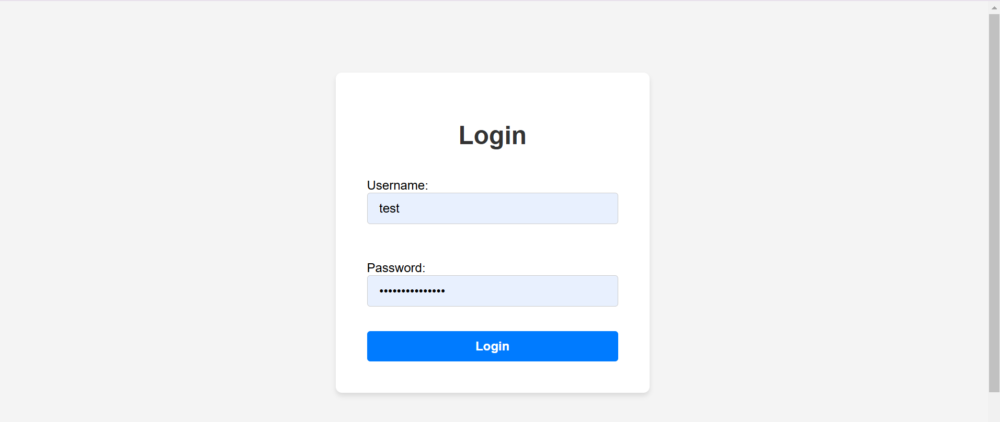
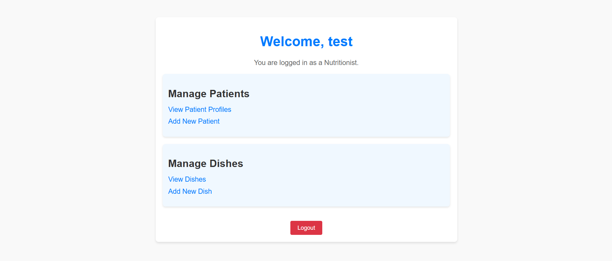
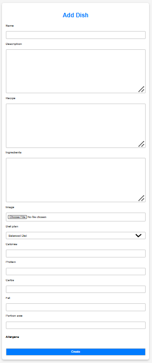
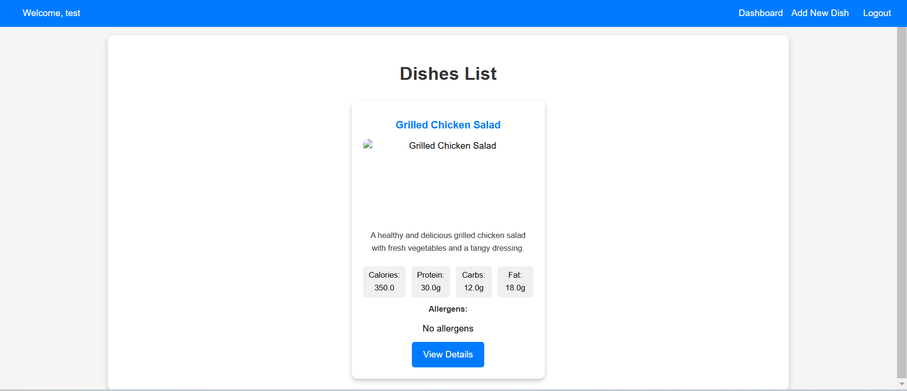
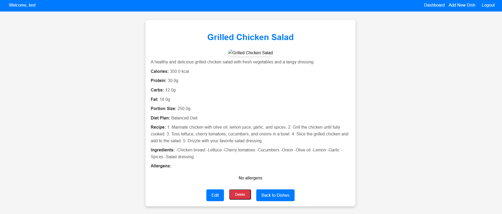
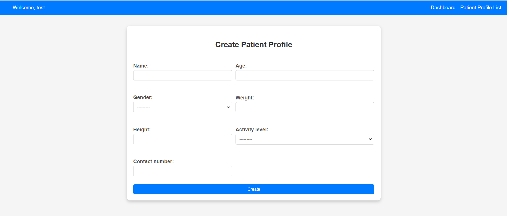
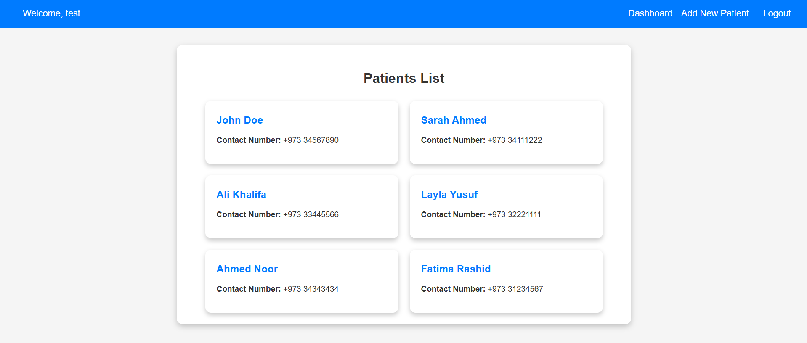
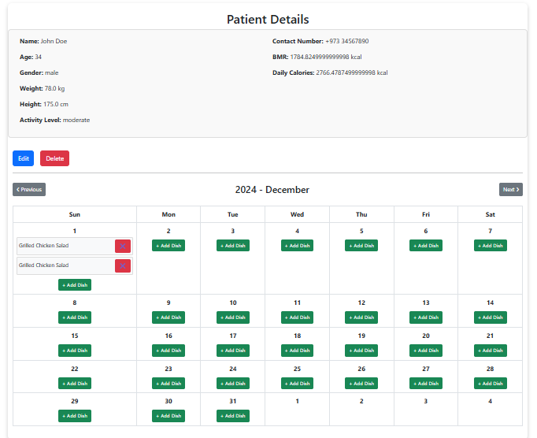

# Django Nutritionists Management System Project

## Project Description

The Django Nutritionists Management System is a health management platform designed specifically for nutritionists. It provides a streamlined process for managing patient profiles, meal plans, and dishes while maintaining role-based authorization. The system allows admins to manage users and nutritionists to create tailored meal plans for patients, and manage dishes with detailed nutritional and allergen information.

This application aims to simplify the workflow for nutritionists, enabling efficient and accurate meal planning.

---

## Live Demo 🚀

You can view the deployed website here: [Nutritionists Management System](https://nutritionists-management-4aeed42d3024.herokuapp.com/users/login/)

username: test
password: r6c9hGX6tXhXVPt

---

## Screenshot

### Login

### Dashboard

### Add Dish Form

### Dishes List

### Dishes Details

### Create Patient

### Patients List

### Patient Details

---

## Features Implemented

### Admin Management
- Admins can:
  - Register new users (nutritionists).
  - Manage existing users (edit, delete).
  - Secure login and logout.

### Nutritionist Dashboard
- Nutritionists can:
  - Create, view, update, and delete patient profiles.
  - Auto-generate meal plans from a main menu template and customize as needed.
  - View patient details, including health metrics like BMR and daily caloric needs.

### Dish Management
- Add, view, update, and delete dishes.
- Assign dishes to specific dietary plans (e.g., keto, balanced diet).
- View detailed nutritional information and allergen warnings for each dish.

### Patient Menu
- Nutritionists can:
  - Assign meals to patients based on a calendar interface.
  - View, add, and remove dishes for specific days.
  - Navigate through months to manage menus effectively.

---

## Technologies Used

- **Backend**: Django
- **Frontend**: HTML, CSS, Bootstrap
- **Database**: PostgreSQL
- **Authentication**: Django’s built-in authentication system
- **File Storage**: Media file handling with Django
- **Other**: Calendar-based menu management

---

## Attributions

- [Bootstrap](https://getbootstrap.com/) for responsive styling.

---

## Planned Features

- **Delivery Management**: Assign delivery areas and manage drivers.
- **Reporting Tools**: Generate detailed reports on patients and meal plans.
- **Enhanced UI/UX**: Further refine user interfaces for better usability.

